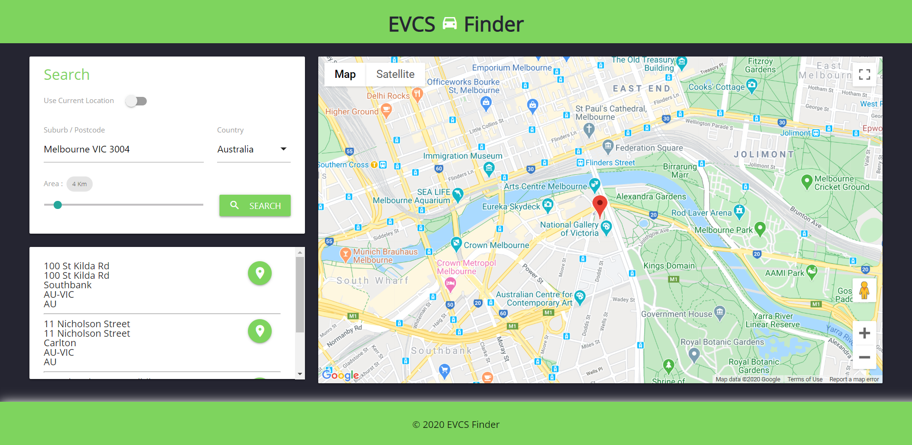

# EVCS Finder

 

## Description
The EVCS Finder helps you find the nearest charging station(CS) to charge your electric vehicle (EV). As buyers around the world embrace more efficient, eco-friendly options, the use of Electric and Hybrid cars continue to grow. This poses a unique challenge for an electric vehicle owner to identify reliable charging locations. 
The EVCS Finder aims to solve this problem by providing users with a list of nearby charging stations based on their current location. The application also provides users the ability to search for charging stations for a given location / destination. This is important because electric vehicles usually take a while to charge and this feature helps users paln their journey better.

## Features
### Responsive Web Design 
This application is built using Responsive web design principles. Responsive web design provides better accessibility and an optimal viewing experience to the user, by ensuring that web pages render well on different devices and window / screen sizes. To achieve this, we have used the Materialize front-end library to build our pages. 

### APIs
This application uses the below third party APIs to fetch location and charging station data:
#### [Geonames API](http://www.geonames.org) 
We used the [Postal Code Search API](https://www.geonames.org/export/web-services.html#postalCodeSearch) to retrieve location data for suburbs / postcodes to enable autocomplete when the user types in a suburb. 
We also used the [Geocode Address API](https://www.geonames.org/maps/addresses.html#geoCodeAddress) to retrieve the geocode - latitude and longitude for a given address typed in by the user.

#### [Google Maps API](https://developers.google.com/maps/documentation?hl=en_GB) 
We used the [Google Maps Static API](https://developers.google.com/maps/documentation/maps-static/intro?hl=en_GB) to display the location of a charging station on Google Maps. 

## Functionality

When the EVCS Finder application is opened, it displays the location search form. Once the user selects a location and search area and clicks the search button, the list of charging stations available at the search location is displayed. When the user selects a charging station, it is then displayed on the map on the right hand pane. 

* The user can choose to search by current location or by selecting an address. 
* When searching by an address, users can then select a country and enter either the postcode or suburb they wish to search for. The location box will display a list of matching suburbs when the user types in the same. The user can also choose to enter a specific address as well.  
* If the search location is not specified when the user clicks the search button,a validation message is displayed to the user. 
* When the application is closed and re-opened, the details of the last searched location is loaded up by default.
* Once the search is executed, a list of charging stations available at the search location is displayed. 
* If no charging stations are found for a given location, a message is displayed to the user.
* When the user clicks on the drop a pin button for a given charging station, the map loads up the location details for that station.
